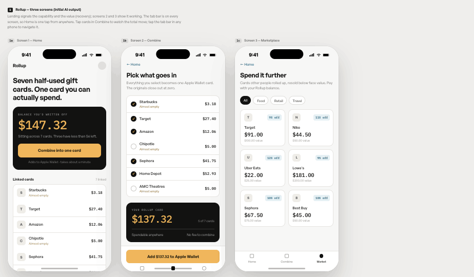
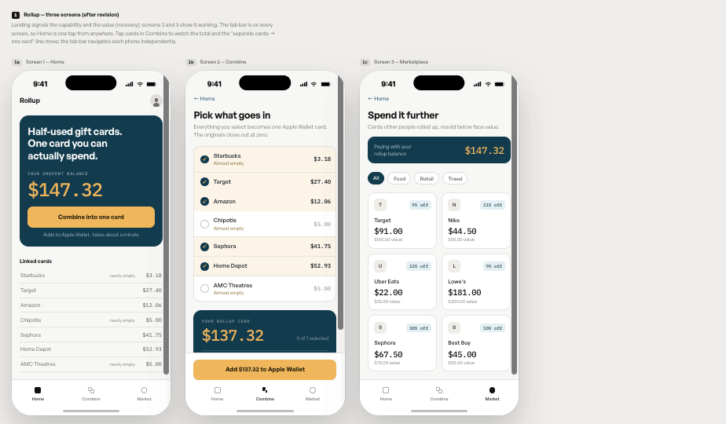

# three_screens

# Rollup — gift card consolidation & marketplace

Three-screen interactive prototype.

**Live:** https://three-screens-ten.vercel.app/ · mirror: https://zburnsie.github.io/three_screens/

## 1. Concept

**Need.** People receive a few gift cards a year, lose track of what is left on each one, and end up leaving partial balances unspent because checking and carrying them costs more effort than the remaining money seems worth.

**Persona.** Receives 3–5 gift cards a year, does not know the balance on any of them, and rediscovers them in a drawer or an email inbox months later.

**Capability.** Combine several gift card balances into one card that can be spent at checkout.

**Fundamental value.** Recovery — money already written off comes back as spendable money. It matters because the alternative is not inconvenience, it is loss: the balance is never spent at all.

## 2. The three screens

| Screen | Its one job | Why it earned a slot | Design question it answers |
|---|---|---|---|
| **1 — Home** | Signal the capability and the recovery value before anything is read | It is the first read; the recovered total and the single primary action carry the whole concept | Does a first-time user understand what this does in five seconds? |
| **2 — Combine** | Show the capability actually happening: select balances, watch them become one card | Consolidation is the product; a static picture of it would not prove it works | Do users understand that the originals collapse into one spendable card? |
| **3 — Marketplace** | Show where recovered money can go further — resold cards below face value | It is the second half of the value loop and the reason balances stay in the system | Does the marketplace read as an extension of the same product, or as a different app? |

Cash-out is intentionally absent from Home. It is a secondary capability and would compete with the primary one.

## 3. Feedback question plan

| Question (as I'd say it) | Prediction | Rests on |
|---|---|---|
| Think of the last gift card you were given. Where is it right now, and how much is on it? | "No idea, somewhere in my email" — balance unknown, card unused | The need statement; validates that unknown balance, not inconvenience, is the blocker |
| I'll show you this screen for five seconds, then hide it. What does this app do? | "Adds up your gift cards into one card" — the headline and the $147.32 carry it | Home: headline + dark balance card |
| If this worked exactly as shown, what's the value to you in one or two words? | "Free money" or "found money" rather than "convenient" | Home: the headline plus "Your unspent balance" above the total |
| What would you tap first, and what do you expect happens? | "Combine into one card" → a Wallet card is created | Home: single amber button, everything else is neutral |
| How often does this come up for you, and what are you usually doing when it does? | Two to four times a year, usually at checkout or cleaning out a wallet or inbox | Persona assumption; tests frequency |
| Is this the same app as the last screen I showed you? | Yes — shared type, dark balance card, tab bar | Screens 2 and 3 reusing Home's visual vocabulary |

## 4. Design justification and first read

**Does the landing screen signal the capability and value at first glance?** The teal balance card is the only saturated block on the screen and holds the largest type on the page, so the eye lands on the headline and `$147.32` before reading anything (figure/ground). The headline names the value, and the button under it names the capability.

**Does every element earn its place?** The linked-card list is the evidence behind the total; it sits below the fold line and in low-contrast neutrals so it supports rather than competes. Cash-out and marketplace are reachable only from the tab bar.

**Grouping.** *Proximity and common region:* the headline, label, total, and button share one teal rounded container, so they read as one statement rather than four elements. *Similarity:* every linked-card row uses the same name-plus-mono-balance pattern, so the list reads as one set and the "nearly empty" flags stand out as a subgroup. *Continuity:* mono numerals right-align down each list, giving a single scan line for balances.

**Do 2 and 3 stay on mission, and can you get home?** Screen 2 is only selection and total. Screen 3 is only inventory. The tab bar is on all three screens, and 2 and 3 also carry a "← Home" link.

**What the AI got wrong / what I changed.** 

The first version was correct and unreadable at the same time. Four problems:

*It showed the numbers but never the consolidation.* Every screen displayed accurate balances, but nothing depicted several cards becoming one — the capability was stated in a button label and nowhere else. I added a live "N separate cards → 1 card in Apple Wallet" line to the rollup card, and made selection on Combine visible: selected rows tint warm and hold full-contrast amounts while deselected ones recede, so the set going in is legible as a group (common region).

*Equal visual weight on the landing screen.* The linked-card list sat in a white card with the same weight as the balance, so two elements competed for the first read and neither signaled the primary capability. I flattened the list into muted rows with no container, so the balance owns the figure and the list reads as ground.

*No color identity.* Everything was white, black, and amber. It was minimalist which I liked but not interesting enough. I introduced one accent (teal), replaced the near-black panels with it so there is a single dark tone, and gave the Marketplace a teal balance block so it reads as the same loop rather than a separate store (continuity). I tried a full-width teal header band on every screen first and cut it because it fought the balance card for attention.

*Wordy where it should be silent.* The balance card carried a line reading "Sitting across 7 cards. Three have less than $6 left," restating what the list below already showed, and the label above the total ("balance you'd written off") asked the reader to accept a premise before they knew what the number was. I cut the line and changed the label to "Your unspent balance." This made the wording a lot more simple rather than over explanation.

Also structural: I cut a card-scanning screen to hold the three-screen limit, made the deployed build a single navigable phone rather than three shown side by side, gave Combine its own tab icon (it shared Home's square), and fixed contrast and hit-target failures on small text and the tab bar.

**Before and after.**

Initial AI output:

After revision:

Initial AI output: commit on `main`, "Add files via upload" — https://github.com/zburnsie/three_screens/commits/main
Revision: PR #1, merged — https://github.com/zburnsie/three_screens/pull/1

